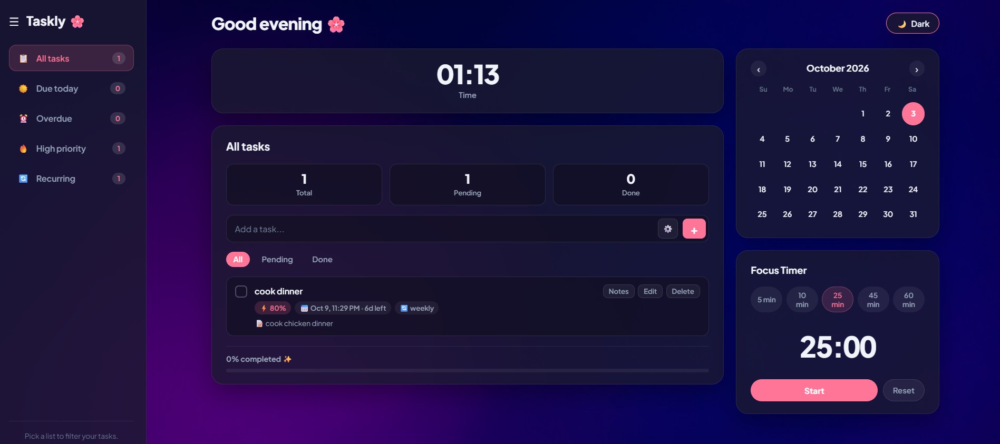
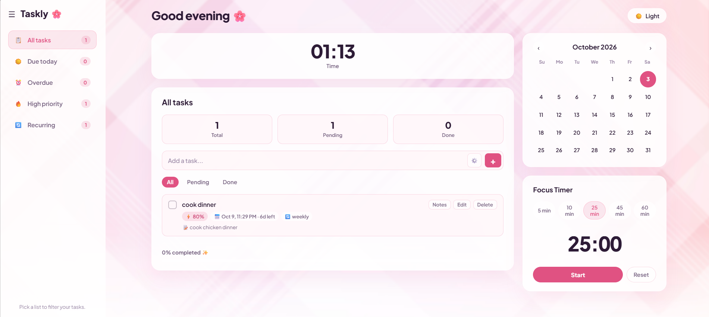

# Taskly 🌸 — Modern Productivity & Task Dashboard

**Taskly** is a sleek, feature-packed web dashboard designed to help you organize your daily tasks, track progress, and boost focus. Built with modern HTML5, Vanilla CSS glassmorphic aesthetics, and vanilla JavaScript.

---

## 🌟 Features

- 📋 **Smart Task Management**:
  - Add, Edit, and Delete tasks with custom priorities (`⚡ High 80%`, `⚡ Medium 60%`, `⚡ Low 30%`).
  - Set deadlines (`📅`), repeat frequency (`🔄 daily/weekly/monthly`), and notes/subtasks (`📝`).
  - Toggle completion state with animated progress tracking (`% completed ✨`).

- 🌸 **Category & List Filtering**:
  - Filter tasks by **All tasks**, **Due today**, **Overdue**, **High priority**, and **Recurring** with real-time sidebar badges.
  - Filter by status tabs: **All**, **Pending**, and **Done**.

- ⏱️ **Focus Timer (Pomodoro)**:
  - Integrated timer with quick duration presets (`5 min`, `10 min`, `25 min`, `45 min`, `60 min`).
  - Start, Pause, and Reset controls with toast notifications upon completion.

- 📅 **Digital Clock & Calendar**:
  - Live digital clock display (`19:19 Time`).
  - Full interactive monthly calendar widget with month navigation and active day highlight.

- 🎨 **Custom Dual Themes**:
  - **Dark Mode**: Deep emerald green textured background (`images/dark-bg.jpg`) with dark glassmorphism cards.
  - **Light Mode**: Pastel pink plaid pattern background (`images/light-bg.png`) with soft glassmorphism cards.

- 💾 **Local Persistence**:
  - All tasks and theme preferences automatically save to your browser's `localStorage`.

---

## Screenshots

### Home Page





---

## 🚀 Getting Started

No installation or dependencies required!

### Option 1: Direct Open
Double-click [`index.html`](file:///c:/Users/mursh/OneDrive/Documents/Desktop/to%20%20do/index.html) or open it in any web browser (Chrome, Edge, Firefox, Safari).

### Option 2: Local Server
Run a simple HTTP server from the project directory:

```bash
# Using Python
python -m http.server 3000

# Using Node / npx
npx serve .
```

Then visit `http://localhost:3000` in your browser.

---

## 📁 Project Structure

```
to do/
├── index.html       # Semantic HTML layout & component grid
├── style.css        # Compact glassmorphism styling & custom themes
├── script.js        # Modular state management, timer, & calendar logic
├── images/
│   ├── dark-bg.jpg  # Dark theme background image
│   └── light-bg.png # Light theme background image
└── README.md        # Project documentation
```

---

## 🛠️ Built With

- **HTML5**: Semantic tags & accessible structure.
- **CSS3**: Custom CSS Variables, Flexbox/Grid, Glassmorphism backdrop-filters.
- **JavaScript (ES6+)**: Vanilla JS without external framework dependencies.
